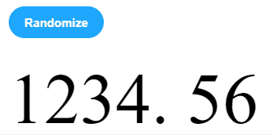

# react-bean-counter

> A spinning dial counter for React, similar to price spinners in the Robinhood stock app.

[](https://www.npmjs.com/package/react-bean-counter) [](https://standardjs.com)



## Install

```bash
npm install --save react-bean-counter
```

## Demo

```bash
git clone git@github.com:BirdTho/react-bean-counter.git
cd react-bean-counter
npm install
npm run storybook
```

## Usage

```tsx
import React from 'react'

import BeanCounter from 'react-bean-counter'

class Example extends Component {
  render() {
    return <BeanCounter value={1234.56} precision={2} className='custom-bean-style'/>
  }
}
```

### Custom styling

`BeanCounter` will automatically calculate metrics of digits based on the size of the font. It uses an offscreen element to measure digit dimensions for a given font and font size.

For instance, you can pass in custom class name to the BeanCounter using the optional `className` parameter.

```css
.custom-bean-style {
  font-size: 16px;
  font-family: Helvetica, sans-serif;
  color: white;
}

.custom-bean-style > span, .custom-bean-style .bean-digit-container {
  background-color: rgb(30, 30, 30);
}
```

## License

MIT © [BirdTho](https://github.com/BirdTho)
